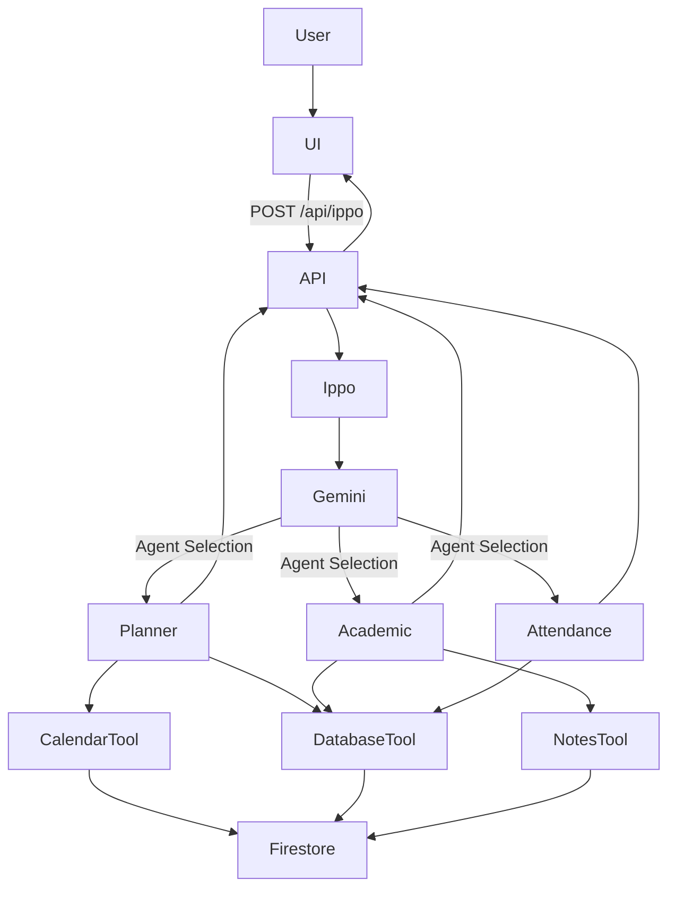

# Next Steps: Frontend Integration, AI Orchestration & Deployment

This document describes the implementation plan for integrating the existing **Ippo** frontend with the newly built Next.js backend architecture.

The objective is to preserve the current UI while making every feature functional using Firestore, Gemini, and the AI Orchestrator.

---

# 1. Core Integration Strategy

The UI has already been designed and approved.

**Do not redesign or simplify the UI.**

The goal is to integrate backend functionality into the existing interface while preserving every visual detail.

Implementation priorities:

1. Convert the existing HTML pages into proper **Next.js App Router React pages**
2. Preserve the exact layout, spacing, colors, typography and interactions
3. Connect the UI to the backend API (`/api/ippo`)
4. Populate Firestore with realistic demo data
5. Visualize AI orchestration through execution traces

---

# 2. System Architecture



---

# 3. Frontend Integration

## 3.1 Convert Existing UI

The current HTML pages should **not** be injected using `dangerouslySetInnerHTML`.

Instead:

* Convert every page into a proper React component.
* Preserve the exact design.
* Preserve all Tailwind classes.
* Preserve responsiveness.
* Preserve all existing animations and styling.

Recommended structure:

```
src/app/

dashboard/page.tsx

planner/page.tsx

timetable/page.tsx

agents/page.tsx
```

No visual redesign is allowed.

---

## 3.2 Connect UI to Ippo

Every AI interaction should call

```
POST /api/ippo
```

Example flow

```
User

↓

askIppo()

↓

/api/ippo

↓

Ippo Orchestrator

↓

Planner / Academic / Attendance

↓

Response

↓

UI
```

Client-side example

```ts
async function askIppo(message: string) {

    showLoading();

    const response = await fetch("/api/ippo",{

        method:"POST",

        headers:{
            "Content-Type":"application/json"
        },

        body:JSON.stringify({
            message
        })

    });

    const result = await response.json();

    renderExecutionTrace(result.executionTrace);

    renderAnswer(result.answer);
}
```

---

# 4. Firestore

Firestore is the application's single source of truth.

Populate Firestore with realistic demo data.

Collections:

```
students

attendance

assignments

timetable

notes
```

If collections do not exist, create them automatically during first write.

Mock data should only be generated if the database is empty.

Do not create a separate seed script unless necessary.

---

# 5. AI Orchestration

Ippo is the only AI visible to users.

Users never directly communicate with specialist agents.

Workflow:

```
User

↓

Ippo

↓

Gemini determines which agent(s) should execute

↓

Planner

Academic

Attendance

↓

Tool Layer

↓

Firestore

↓

Gemini

↓

Final Response
```

Avoid unnecessary rule-based routing.

Gemini should determine which agent(s) are required and return structured JSON describing:

* selected agent(s)
* execution order
* reasoning

The orchestrator should execute the requested agents and merge the results into a single response.

---

# 6. Tool Layer

Agents must never directly access Firestore.

All data access should occur through reusable tools.

```
Planner

↓

CalendarTool

↓

DatabaseTool

↓

Firestore
```

```
Academic

↓

NotesTool

↓

DatabaseTool

↓

Firestore
```

```
Attendance

↓

DatabaseTool

↓

Firestore
```

---

# 7. Execution Trace

Every response should include an execution trace.

Example:

```
Ippo

↓

Planner Agent

↓

Calendar Tool

↓

Database Tool

↓

Gemini

↓

Study Plan Generated
```

The frontend should animate this pipeline so users can understand how Ippo solved the request.

This execution trace is an important demonstration of the multi-agent architecture.

---

# 8. UI Requirements

During implementation:

* Preserve every existing page
* Preserve layouts
* Preserve colors
* Preserve spacing
* Preserve typography
* Preserve animations

Only backend functionality should be added.

No redesign.

No simplification.

No component replacement unless required for React compatibility.

---

# 9. Deployment

Deploy using **Vercel**.

Reasons:

* Native Next.js support
* Automatic API Route deployment
* Easy environment variable management
* Excellent Firebase compatibility
* Fast deployments

Deployment steps:

```bash
npm i -g vercel

vercel

vercel --prod
```

Environment Variables:

```
GEMINI_API_KEY

NEXT_PUBLIC_FIREBASE_API_KEY

NEXT_PUBLIC_FIREBASE_AUTH_DOMAIN

NEXT_PUBLIC_FIREBASE_PROJECT_ID

NEXT_PUBLIC_FIREBASE_STORAGE_BUCKET

NEXT_PUBLIC_FIREBASE_MESSAGING_SENDER_ID

NEXT_PUBLIC_FIREBASE_APP_ID

NEXT_PUBLIC_FIREBASE_MEASUREMENT_ID
```

---

# 10. Implementation Principles

During implementation:

* Build working functionality instead of placeholders.
* Do not introduce unnecessary abstractions.
* Do not over-engineer.
* Keep the architecture modular and easy to extend.
* Preserve the existing UI.
* Ensure every implemented feature works end-to-end.

Priority order:

1. End-to-end functionality
2. Existing UI preservation
3. Clean architecture
4. Type safety
5. Minimal code duplication
6. Production readiness

The final application should be fully functional, visually identical to the approved UI, and clearly demonstrate AI orchestration, specialized agents, Firestore integration, Gemini reasoning, and execution trace visualization for the Kaggle AI Agents Capstone.

# 11. Success Criteria

The implementation is considered complete when:

- All existing UI pages are converted into functional Next.js pages.
- The visual design remains unchanged.
- `/api/ippo` successfully receives requests.
- Ippo correctly routes requests to one or more agents.
- PlannerAgent, AcademicAgent and AttendanceAgent are functional.
- Firestore stores and retrieves application data.
- Gemini generates responses where appropriate.
- Execution traces are visible in the UI.
- The project builds successfully with `npm run build`.
- The project deploys successfully on Vercel.

# 12. AI Implementation Rules

During implementation:

- Do not redesign the UI.
- Do not replace existing layouts.
- Do not remove existing features.
- Prefer extending existing code instead of rewriting it.
- Keep components modular.
- Avoid placeholder implementations.
- Avoid TODO comments.
- Use real Firestore integration.
- Use the actual Gemini API.
- Ensure every feature is functional before moving to the next.
- Keep the architecture simple and production-ready.