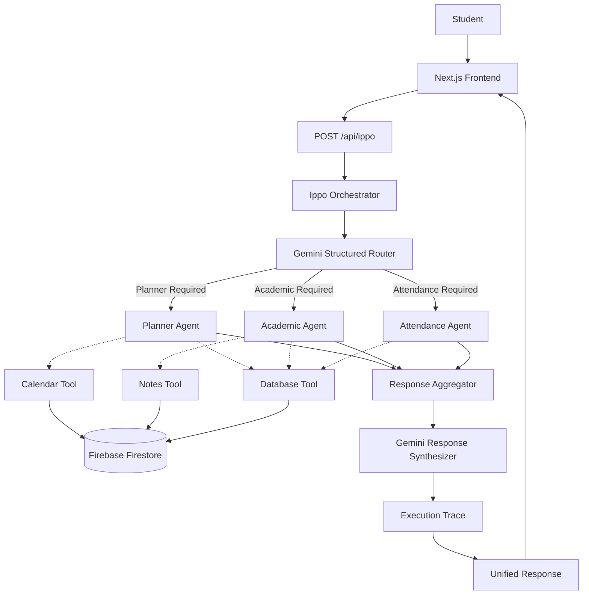
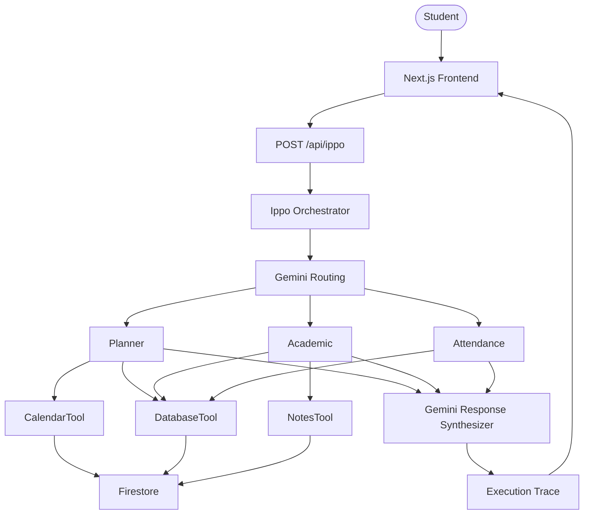

# Ippo companion



# 🎓 IPPO — AI Student Operating System

> An AI-powered Student Operating System that unifies planning, attendance tracking, timetable management, assignments, and academic assistance through a multi-agent architecture.


---

## 📖 Overview

Ippo is an AI-powered Student Operating System that brings together the scattered tools students rely on—timetables, assignments, attendance tracking, notes, and study planning—into a single platform.

Instead of acting as a generic chatbot, Ippo uses a **multi-agent architecture** where specialized agents collaborate behind a single conversational interface to solve academic tasks.
THE NAME "IPPO COMPANION"?
The name Ippo comes from the Japanese word 一歩 (ippo), meaning "one step."
The idea behind the project is that students don't need an AI that just hands them answers — they need a companion that helps them take the next step in their academic journey, whether that's planning a study session, improving attendance, preparing for an exam, or organizing assignments.

"Companion" reflects the system's role as an always-available academic assistant, not just another chatbot. Rather than making decisions for the student, Ippo guides them by coordinating specialized agents to provide timely, context-aware help.
Together, Ippo Companion represents an AI partner that helps students move one step closer to their academic goals, one task at a time.
AI-powered Student Operating System built with Next.js, Gemini, Firebase, and a multi-agent architecture for academic planning and productivity.
---

# ✨ Features

- 📅 Smart Study Planner
- 📚 Academic Assistant
- 📊 Attendance Monitoring
- 🗓️ Weekly Timetable
- ✅ Assignment & Task Management
- 🤖 AI Chat with Ippo
- 🔄 Multi-Agent Orchestration
- 🔍 Execution Trace Visualization
- ☁️ Firebase Firestore Integration

---

# ❓ Problem

Managing academic life often means switching between calendars, learning platforms, notes apps, and to-do lists.

Most productivity tools only organize information—they don't understand a student's academic context, making it difficult to answer questions like:

- Which subject is at risk?
- When should I actually study?
- How many classes can I miss?
- What's due this week?

---

# 💡 Solution

Ippo introduces a central AI orchestrator that receives every request and decides which specialist agent(s) should execute it.

Current agents include:

### 📅 Planner Agent

- Builds study schedules
- Finds free timetable slots
- Organizes assignments around deadlines

### 📚 Academic Agent

- Retrieves notes and syllabus content
- Answers academic questions
- Assists with coursework preparation

### 📊 Attendance Agent

- Calculates attendance percentages
- Flags risky subjects
- Computes required classes to recover attendance

Users only communicate with **Ippo** while the agents collaborate in the background.

---

# 🏗️ Architecture



---

# ⚙️ AI Orchestration

Every request first reaches the **Ippo Orchestrator**.

The orchestrator asks Gemini to return a structured routing decision describing:

- Selected agent(s)
- Execution order
- Routing reasoning

The orchestrator then:

1. Executes the selected agents
2. Collects their outputs
3. Synthesizes one final response
4. Returns an execution trace to the UI

This allows users to see exactly how their request was processed.

---

# 🛠 Technology Stack

| Category | Technology |
|-----------|------------|
| Framework | Next.js 15 (App Router) |
| Frontend | React + TypeScript |
| Styling | Tailwind CSS |
| Backend | Next.js API Routes |
| Database | Firebase Firestore |
| AI | Google Gemini API |
| Deployment | Vercel |

---

# 📂 Project Structure

```text
src/
├── agents/
├── app/
│   ├── agents/
│   ├── dashboard/
│   ├── planner/
│   ├── timetable/
│   └── api/ippo/
├── components/
├── firebase/
├── lib/
├── orchestrator/
├── tools/
└── types/
```

---

# 🚀 Installation

## Clone Repository

```bash
git clone https://github.com/Tswetabh/Ippo-companion.git
cd Ippo-companion
```

## Install Dependencies

```bash
npm install
```

---

# 🔑 Environment Variables

Create a `.env.local` file.

```env
GEMINI_API_KEY=YOUR_GEMINI_API_KEY

NEXT_PUBLIC_FIREBASE_API_KEY=YOUR_FIREBASE_API_KEY
NEXT_PUBLIC_FIREBASE_AUTH_DOMAIN=YOUR_PROJECT.firebaseapp.com
NEXT_PUBLIC_FIREBASE_PROJECT_ID=YOUR_PROJECT_ID
NEXT_PUBLIC_FIREBASE_STORAGE_BUCKET=YOUR_PROJECT.firebasestorage.app
NEXT_PUBLIC_FIREBASE_MESSAGING_SENDER_ID=YOUR_SENDER_ID
NEXT_PUBLIC_FIREBASE_APP_ID=YOUR_APP_ID
NEXT_PUBLIC_FIREBASE_MEASUREMENT_ID=YOUR_MEASUREMENT_ID
```

---

# 🔥 Firebase Setup

1. Create a Firebase project.
2. Enable Cloud Firestore.
3. Create a Web App.
4. Copy the Firebase configuration into `.env.local`.

On first launch, the application automatically creates demo collections if the database is empty.

---

# ▶️ Running Locally

Development

```bash
npm run dev
```

Open

```
http://localhost:3000
```

Production Build

```bash
npm run build
npm start
```

---

# ☁️ Deployment

Deploy using Vercel.

```bash
npm install -g vercel

vercel

vercel --prod
```

Configure all Firebase and Gemini environment variables in the Vercel dashboard before deploying.

---

# 💻 Using Ippo

## Dashboard

- Attendance overview
- Upcoming classes
- Assignments
- Daily summary

## Planner

- Create tasks
- Organize assignments
- Generate study plans

## Timetable

- Weekly schedule
- Free-slot detection
- Study planning

## AI Chat

Example prompts:

```
Plan my study week.

What is my attendance?

What assignments are due this week?

What is my timetable tomorrow?

Help me prepare for my DBMS exam.
```

---

# 🎯 Course Concepts Demonstrated

This project applies concepts from Google's **5-Day AI Agents: Intensive Vibe Coding Course**, including:

- Multi-Agent Architecture
- AI Orchestration
- Tool-based Agent Design
- Firestore Shared Memory
- Gemini-powered Reasoning
- Execution Trace Visualization
- Full-stack Next.js Deployment

---

# 🔮 Future Improvements

- Google Calendar Integration
- Email Integration
- Retrieval-Augmented Generation (RAG)
- Authentication & Multi-user Support
- Career Agent
- Recommendation Agent
- Wellness Agent

---

# 📄 License

This project is licensed under the MIT License.

---

## 👨‍💻 Author

**Swetabh Tripathy**

GitHub: https://github.com/Tswetabh

Built as a submission for the **Google × Kaggle AI Agents Capstone Project**.
